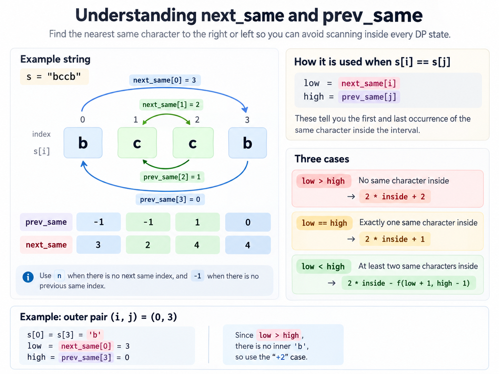

# Count palindrome subsequences

It's same as the title, simple problem description for once.
For a string s, number of palindrom subsequences in it.

## Solution

f(i,j) is palindromes inside that range.

So basically,
if not match: f(i+1,j) + f(i-1,j) - f(i+1,j-1) => for the double count
if match: ^ the above will still stay as that's count where we ignore the
current match. 1 would be added for the s(i) == s(j) case itself, and
since we can extend the f(i+1,j-1) ones we add those too.

This above is correct but the detail I missed is that the problem does not
consider difference based on indexes, the characters need to differ as well.
And with this comes another detail, chars are ONLY a,b,c or d.

> always ask, how are they treated differently

There is an idea that usse dp(i,j,c) and wors for this case as |c| is small.
But here's the general way.



For the not same case, it's still the same. For the same case, we say
in = inside palindromes.

```text
b ... b
if no bb inside => inside + inside (extended) + 1 for bb and 1 for b

b ...b... b
inside + inside (extended)  + 1 for bb, no need for b as it's counted
in the inside subrange

b ...b...b... b
inside + inside (extended, note that all these extend length)
but what of the palindromes in betweent the inner inner b, they are now
counted twice so subtract
```

```python
from functools import cache


class Solution:
    def countPalindromicSubsequences(self, s: str) -> int:
        mod = 10**9 + 7
        n = len(s)

        # next_pos[i] = next index > i with same character as s[i]
        # prev_pos[i] = previous index < i with same character as s[i]
        next_pos = [n] * n
        prev_pos = [-1] * n

        last = {}
        for i in range(n):
            if s[i] in last:
                prev_pos[i] = last[s[i]]
            last[s[i]] = i

        last = {}
        for i in range(n - 1, -1, -1):
            if s[i] in last:
                next_pos[i] = last[s[i]]
            last[s[i]] = i

        @cache
        def f(i, j):
            if i > j:
                return 0
            if i == j:
                return 1

            if s[i] != s[j]:
                ans = f(i + 1, j) + f(i, j - 1) - f(i + 1, j - 1)
                return ans % mod

            inside = f(i + 1, j - 1)
            low = next_pos[i]
            high = prev_pos[j]

            if low > high:
                ans = 2 * inside + 2
            elif low == high:
                ans = 2 * inside + 1
            else:
                duplicates = f(low + 1, high - 1)
                ans = 2 * inside - duplicates

            return ans % mod

        return f(0, n - 1)
```
