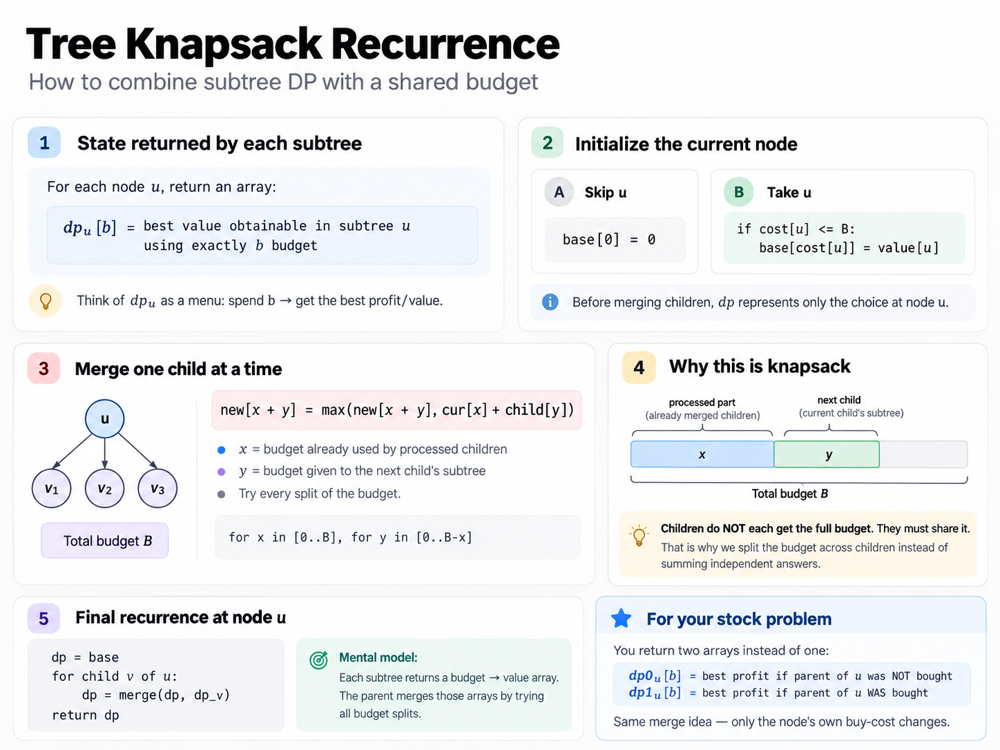

# Max profit from trading stock with discounts

The statement is a bit too verbose but here's the idea.

You have a directed tree. The root is 1 and the egdes point to sub-ordinates.
You have a cur and a fut array, both representing prices for each node.
Condition being: if direct parent buys, cur for me becomes half.
Total funds for buying across all employees is fixed, find max profit.

## Solution

An incorrect observation I see is that the fut is not needed really, until the end.
I was thinking min the funds and then subtract from sum of futs. That does NOT give
you a maximum profit as a global sum minima will not necessarily lead to a higher
overall profit. Say the minima is dominated by a low value on on node, but the profit
for the node is low since fut for the node is low as well.

Second is that I only need to know info on parent to do the transition.

f(i, parent buys) = max profit for ith employee AND all descendants if my parent
buys. For my case I know the profit, for each of my employees, I aggregate over their
two states.

Actually, just this would make it optimal for everyone to buy, I missed the budget
constraint, which look awfully lot like a knapsack constraint.

Remember how in a knapsack the budget itself is state, it's 160 here which
seems to be intended for that.

I wrote something this first but problem is that I'm resuing the budget independently across
the children.

```python
class Solution:
    def maxProfit(
        self, n: int, cur: List[int], fut: List[int], edges: List[List[int]], bud: int
    ) -> int:
        g = [[] for _ in range(n + 1)]
        for u, v in edges:
            g[u].append(v)

        @cache
        def f(i, par_buy, rem_bud):
            if rem_bud < 0:
                return -math.inf

            cost = cur[i - 1] // 2 if par_buy else cur[i - 1]
            buy = fut[i - 1] - cost
            no_buy = 0

            for j in g[i]:
                buy += f(j, True, rem_bud - cost)
                no_buy += f(j, False, rem_bud)

            return max(buy, no_buy)

        return f(1, False, bud)
```

The problem is apparently a standard **tree knapsack**.

This image that chatgpt made me is really helpful here to visualise the idea, especially point 4
to show how the splits are being done.


```python
class Solution:
    def maxProfit(
        self, n: int, cur: List[int], fut: List[int], edges: List[List[int]], bud: int
    ) -> int:
        g = [[] for _ in range(n + 1)]
        for u, v in edges:
            g[u].append(v)

        # this merges two entire arrays, where a is the parent array
        # and b is the child's
        def merge(a, b):
            res = [-inf] * (bud + 1)

            for x in range(bud + 1):
                for y in range(bud - x + 1):
                    res[x + y] = max(res[x + y], a[x] + b[y])

            return res

        # f(b) = max profit using EXACTLY b budget in subtree i
        # for each state here, we eval for ALL budgets hence no
        # budget state in args
        @cache
        def f(i, par_buy):

            # don't buy i
            no = [-inf] * (bud + 1)
            no[0] = 0

            for j in g[i]:
                # a continous left to rigth merge, done one for each
                # child
                no = merge(no, f(j, False))

            # buy i
            cost = cur[i - 1] // 2 if par_buy else cur[i - 1]
            buy = [-inf] * (bud + 1)

            if cost <= bud:
                buy[cost] = fut[i - 1] - cost

                for j in g[i]:
                    buy = merge(buy, f(j, True))

            return tuple(max(no[b], buy[b]) for b in range(bud + 1))

        return max(f(1, False))
```
