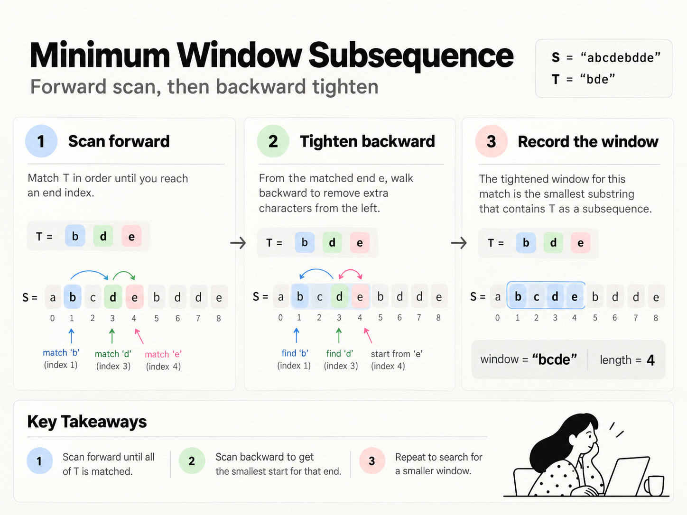

# Minimum window subsequence

Find min size window in S suich that T is a subsequence of that window.

## Solution

If you relate to min window substring ( which really was min window subcounter), there I can
immediately know if I have enough chars in my window,

This is simialr to lcs. You move forward in S and match i in S with j in T. You can always
skip OR if the chars match choose to take.

```python
from functools import cache

class Solution:
    def minWindow(self, s: str, t: str) -> str:
        n, m = len(s), len(t)

        @cache
        def dp(i, j):
            # matched all of t
            if j == m:
                # end would be some previous
                return i - 1

            # ran out of s
            if i == n:
                return n  # impossible

            if s[i] == t[j]:
                return min(
                    dp(i + 1, j + 1),  # take s[i]
                    dp(i + 1, j)       # skip s[i]
                )

            return dp(i + 1, j)         # skip s[i]

        best_start = -1
        best_len = float("inf")

        # we then try each starts
        for start in range(n):
            if s[start] == t[0]:
                end = dp(start + 1, 1)

                if end != n:
                    length = end - start + 1

                    if length < best_len:
                        best_len = length
                        best_start = start

        if best_start == -1:
            return ""

        return s[best_start:best_start + best_len]
```

Is there a case where you would skip a match? Never, that min can be skipped, it's a fixed
path.

## Solution 2

I've seen this style in some other problem though I don't quite recall now.

```python
class Solution:
    def minWindow(self, s: str, t: str) -> str:
        n, m = len(s), len(t)

        best_start = 0
        best_len = float("inf")

        i = 0

        while i < n:
            j = 0

            # forward scan: find a complete T
            while i < n:
                if s[i] == t[j]:
                    j += 1

                    if j == m:
                        break

                i += 1

            # never possible, there just aren't enough chars
            if j < m:
                break

            # i is the ending index
            end = i

            # backward scan: tighten the start
            j = m - 1

            while j >= 0:
                if s[i] == t[j]:
                    j -= 1
                i -= 1

            start = i + 1

            if end - start + 1 < best_len:
                best_len = end - start + 1
                best_start = start

            # search again after this start
            i = start + 1

        if best_len == float("inf"):
            return ""

        return s[best_start:best_start + best_len]
```


