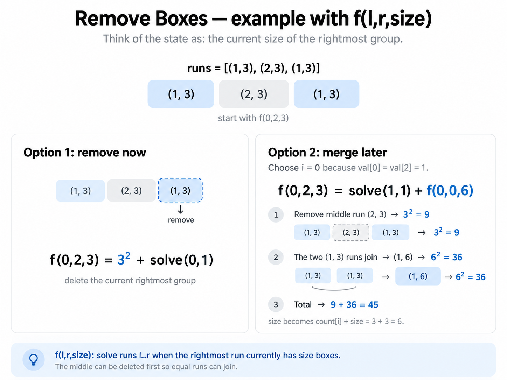

# Remove Boxes

A list of integers. In one move you can pick a contiguous range of same numbers,
say it's length is k, then if you remove that you get k^2 points.
Find max points.

## Solution

This is another one of those famous interval DP problems.

To solve for a range `(l,r)`, you can pick any valid subrange, delete it for `k^2` points. But consider `1 1 1 2 2 2 1 1 1`. You cannot just remove the `2`s and then solve the left and right `1`s independently, since deleting the middle makes the two `1` groups join.

As runs this is `[(1,3), (2,3), (1,3)]`, so we need some additional carried-in state.

First encode the array as runs. Let `val[i]` and `count[i]` describe run `i`.

Define `f(l,r,size)` as the best score for runs `l...r`, where the rightmost run currently has `size` boxes. Normally `size = count[r]`, but it may be larger because an earlier recurrence deleted the middle and merged another equal-valued run into it.

Now there are two choices.

Option 1: remove the rightmost group now, giving `size^2 + solve(l,r-1)`.

Option 2: for any `i < r` with `val[i] = val[r]`, delete the middle `i+1...r-1`, causing the two runs to join. This gives `solve(i+1,r-1) + f(l,i,count[i] + size)`.

For `[(1,3), (2,3), (1,3)]`, instead of removing the last `(1,3)`, delete `(2,3)` first and merge the two `1` runs, giving `3^2 + 6^2 = 45`.

Here's an image to show transitions on the 2nd case.



You can relate the first transition where you only delete the rightmost branch to burst
baloons as in any valid order there would be SOME rightmost branch that gets deleted UNLESS
you have the middle one is better case.
For example, `111222333`, you doing a delete on the middle 2 and then the 3s give you nothing
different from just deleting from the right.

> this bias on rightmost seems to be a common trait in such interval dp problems
> though of course it does not always hold, I might be looking into this too much as say for
> the case of the middle branch we delete, that is clearly not right bias ( I tried to submit
> a version that was and it's wrong )

```python
class Solution:
    def removeBoxes(self, boxes: list[int]) -> int:
        runs = [(val, len(list(iter))) for val, iter in groupby(boxes)]

        @cache
        # l, r as range as k as the len of the block at r ( not from )
        def f(l, r, k):
            if l == r:
                return k * k

            # option 1: remove the rightmost group
            ans = k * k + f(l, r - 1, runs[r - 1][1])

            # option 2: delete some middle one where ends can be matched
            # skip r and r-1
            for i in range(r - 2, l - 1, -1):
                if runs[i][0] == runs[r][0]:
                    mid = f(i + 1, r - 1, runs[r - 1][1])
                    # join boxes to the left one
                    joined_size = k + runs[i][1]
                    ans = max(ans, mid + f(l, i, joined_size))
                    break

            return ans

        return f(0, len(runs) - 1, runs[-1][1])
```
