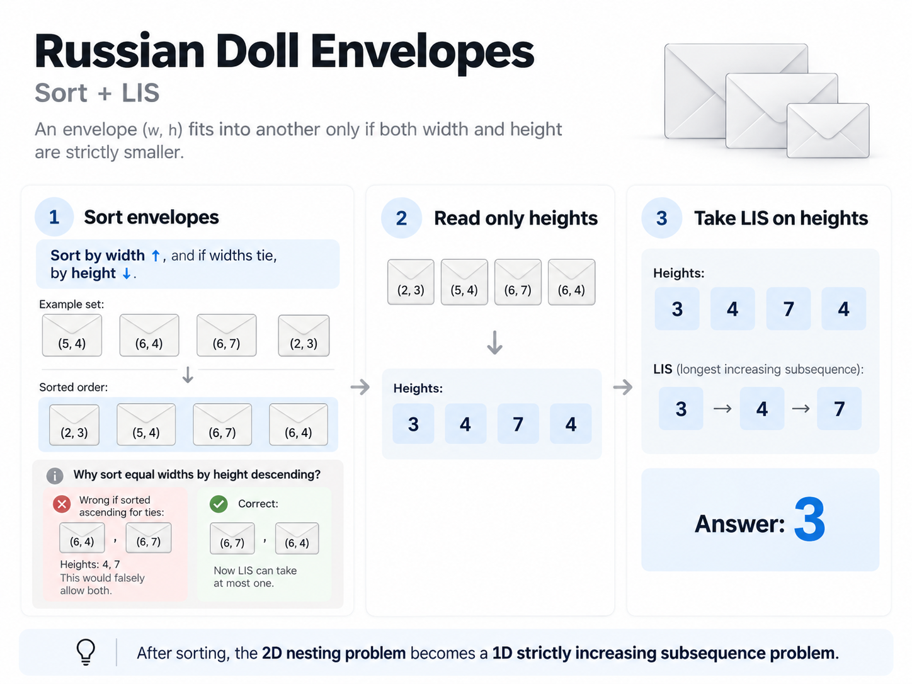

# Russian Doll Envelopes

Given n rectangles, you can put one inside another if both h and w are stricly smaller.
How many can you stack?

## Solution

The sizing rule makes it directed as in for env a you can wrap it in (env b...) set.
Then a longest path in dag follows so then all that remaisn is making edges.
But even that is a challenge here, as note that every pair would be ONE egde,
here that's just not possible.

This was one of the peculiar ones as far as the solution goes. Rather treat it as a "special"
case for a generic approach does not quite fit in.

This image that chatgpt made for me is just perfect.


```python
class Solution:
    def maxEnvelopes(self, arr: list[list[int]]) -> int:
        # this'll sort asc such that first is asc, 2nd is desc
        arr.sort(key=lambda e: (e[0], -e[-1]))

        elems = [e[1] for e in arr]
        # usual lis on elems now
        tails = []
        for x in elems:
            # find the first index where I can put it
            # this is same as cpp's lower bound
            pos = bisect_left(tails, x)

            if pos == len(tails):
                tails.append(x)
            else:
                tails[pos] = x

        return len(tails)
```
