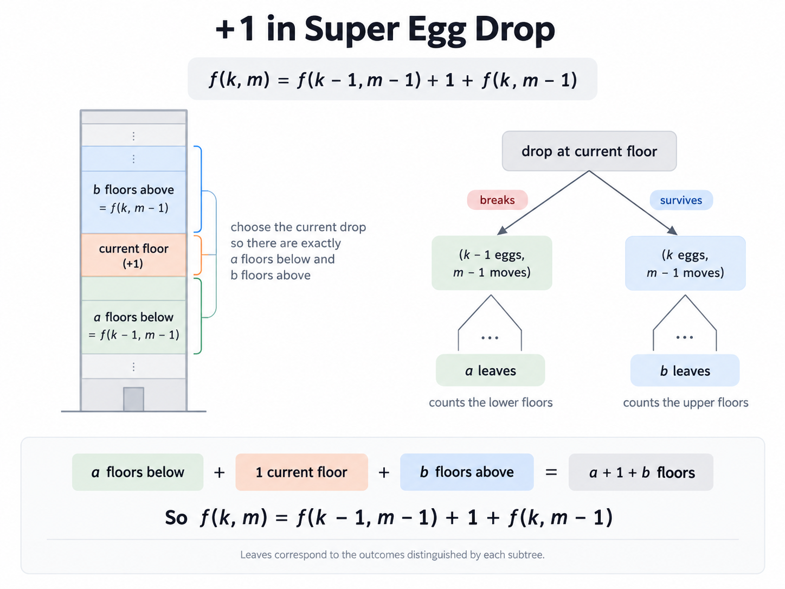

# Super Egg Drop

The problem is famous, especially the 2 egg 100 floor version of it.

I want to do this writeup particularly because of the different solutions to it.
Some being pretty ingenious.

For simplicity, floors are $1,2,\dots,n$, there's no physical floor $0$.

One small thing to keep in mind is that $n$ physical floors gives us $n+1$
possible states to distinguish.

For example, with 3 floors:

```text
| 1 2 3
1 | 2 3
1 2 | 3
1 2 3 |
```

The `|` is the boundary between floors where the egg survives and floors where
it breaks.

So with $n$ floors, there are $n+1$ possible positions for this boundary.

## Simple recursion

This is probably what someone would come up with on their own.

Define

$$
f(eggs, floors)
$$

as the minimum number of drops needed to determine the boundary, given some
number of eggs and some number of physical floors still left to distinguish.

Say we drop at floor $x$.

There are two possibilities:

- it breaks => we need to distinguish the $x-1$ floors below it, with one less egg
- it survives => we need to distinguish the $n-x$ floors above it, with the same number of eggs

We don't control which of these happens, so for a particular floor $x$, we
have to take the worse of the two:

$$
1 + \max(
f(eggs-1,x-1),
f(eggs,n-x)
)
$$

The $1$ is for the drop we just made.

But we do control which floor $x$ we drop from, so we try every possible floor
and take the best one:

$$
f(eggs,n)
=
1+
\min_{1\le x\le n}
\max
\left(
f(eggs-1,x-1),
f(eggs,n-x)
\right)
$$

So the idea is basically:

```text
pick a floor
    |
    +-- breaks    -> one less egg, search below
    |
    +-- survives  -> same eggs, search above

take max of the two, since we care about the worst case

then min over every floor we could have picked
```

Even though $n$ physical floors correspond to $n+1$ possible boundary
states, we still call the recursion with $n$.

The argument `floors` is counting the physical floors still unresolved, not the
number of possible boundary states.

```python
class Solution:
    @cache
    def superEggDrop(self, k: int, n: int) -> int:
        if k == 1 or n <= 1:
            return n
        ans = math.inf
        for i in range(1, n + 1):
            # breaks
            a = self.superEggDrop(k - 1, i - 1)
            # lives
            b = self.superEggDrop(k, n - i)
            ans = min(ans, 1 + max(a, b))
        return ans
```

is one solution but is quite slow and we cannot really do much about the recurrence
due to min and max.

This above TLEs, you can bin search but there's better solutions overall.

## Inverted recurrence

Instead of asking for the minimum drops for n floors, ask for the maximum floors we can count
via k eggs and m drops.

This formulation was very non-intuitive to me as we are considering breaks/lives and are
adding both branches instead of choosing one.
The idea is counting "leaves" in the state tree instead of "depth" ( the previous solution ).

Think of it this way

```
b floors above
----------------
current floor
----------------
a floors below
```

pick one current floor, and budget enough floors below for the break case, and enough floors above for the survive case

> even after staring at it for a long time, I still don't find it intuitive, maybe some day



## Combinatorics

You can telescope the recurrence above to get to this but a direct argument is much more
simpler.

first is identifying thresholds states vs floors

```text
| 1 2 3
1 | 2 3
1 2 | 3
1 2 3 |
```

The line simply means, after this it starts to break, for n floors, you have n+1 states.

Now for all the n+1 places, we need to put a 0 or 1, a 0 meaning it lives and a 1 meaning
it breaks.

For a fixed dropping strategy, each possible critical-floor state produces one outcome string.
If the strategy is correct, two different states cannot produce the same string.
A weak argument to reason is that IF your strategy does not map to unique bit strings, it's
not optimal as it's wasting information.

Then count total numbers of states, we can have upto k ones so this is just
$$\sum_{i=0}^k \binom m i = states = N+1$$
if N is the number of floors

```python
from math import comb

class Solution:
    def superEggDrop(self, k: int, n: int) -> int:
        moves = 0

        while True:
            # Number of distinguishable threshold states
            states = sum(comb(moves, i) for i in range(k + 1))

            # n floors => n + 1 possible threshold states
            if states >= n + 1:
                return moves

            moves += 1
```
