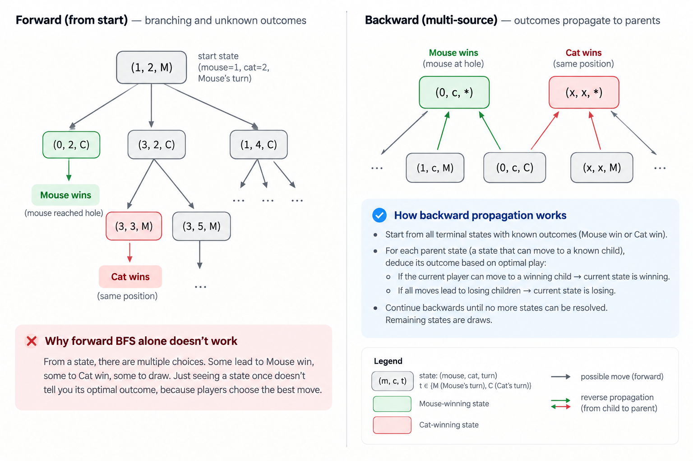

# Cat and mouse

Undirected graph. Cat starts at 2, mouse at 1, and 0 is hole.
Both can move 1 edge in each turn. Mouse wins if it reaches hole, cat if it is at the same position
as the mouse, if there is any case where (cat, mouse, turn) is repeated it's a draw.
Outcome if both play optimally?

## Solution

It seems like another of those multi source bfs problems with additional contraint of a draw that
both players will try to force to avoid a loss.

> actually no, I was confusing it with that "simultaneous turns" varition. This problem uses
> alternate turns.

Given the constraints are too less, I feel I can just simulate with a bfs and a seen state to guard.
There's also this contraint that graph(i) is unique which I am not sure yet what that is for.

_problem with a forward bfs simulation_
These are alternate turns, the best move from current, depends on later states if you imagine it
as a dp, so the bfs option is to start from the desination and bfs in reverse to the starting positions.



_rethinking_

so finally, here's the whole idea. Start from all known terminal outcomes and propagate forced outcomes backward. A parent becomes winning if the player to move has at least one winning move; it becomes losing if every move loses. Anything never resolved is a draw.

```python
from collections import deque

class Solution:
    def catMouseGame(self, g):
        n = len(g)

        DRAW = 0
        MOUSE_WIN = 1
        CAT_WIN = 2

        MOUSE_TURN = 0
        CAT_TURN = 1

        # result[m][c][turn]
        # initially everything is a draw
        result = [[[DRAW] * 2 for _ in range(n)] for _ in range(n)]
        degree = [[[0] * 2 for _ in range(n)] for _ in range(n)]

        q = deque()

        # 1) Count legal moves from every state
        for m in range(n):
            for c in range(1, n):
                degree[m][c][MOUSE_TURN] = len(g[m])
                degree[m][c][CAT_TURN] = len(g[c]) - (0 in g[c])

        # 2) Seed Mouse-win terminal states
        for c in range(1, n):
            for turn in (MOUSE_TURN, CAT_TURN):
                # mouse at 0, cat anywhere and turn is any
                result[0][c][turn] = MOUSE_WIN
                q.append((0, c, turn))

        # 3) Seed Cat-win terminal states
        for x in range(1, n):
            for turn in (MOUSE_TURN, CAT_TURN):
                # turn can be any, both on same non zero node
                result[x][x][turn] = CAT_WIN
                q.append((x, x, turn))

        # 4) Reverse BFS
        while q:
            m, c, turn = q.popleft()
            winner = result[m][c][turn]

            # 5) Find states that could move into this one
            if turn == MOUSE_TURN:
                parents = (
                    (m, prev_cat, CAT_TURN)
                    for prev_cat in g[c]
                    if prev_cat != 0
                )
            else:
                parents = (
                    (prev_mouse, c, MOUSE_TURN)
                    for prev_mouse in g[m]
                )

            for pm, pc, parent_turn in parents:
                # skip seen
                if result[pm][pc][parent_turn] != DRAW:
                    continue

                # if we are here we are at SOME winning state
                # if the parent was mouse, it won
                player = (
                    MOUSE_WIN if parent_turn == MOUSE_TURN
                    else CAT_WIN
                )

                # 6) One winning move is enough
                if winner == player:
                    result[pm][pc][parent_turn] = player
                    q.append((pm, pc, parent_turn))

                # 7) Otherwise this move loses
                else:
                    degree[pm][pc][parent_turn] -= 1

                    # If every move loses, opponent wins
                    if degree[pm][pc][parent_turn] == 0:
                        opponent = CAT_WIN if player == MOUSE_WIN else MOUSE_WIN
                        result[pm][pc][parent_turn] = opponent
                        q.append((pm, pc, parent_turn))

        # 8) Mouse starts at 1, Cat at 2, Mouse moves first
        return result[1][2][MOUSE_TURN]
```

> I wasn't able to solve it on my own, the impl is fairly involved as well, I need to revisit this one again.
