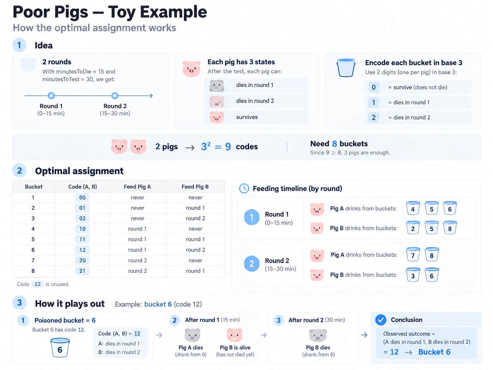

# Poor Pigs

n buckets, one is poison
I can use any number of pigs ( but needed minimum ) and take some pigs and feed from
some bucket then wait for d time and check result. Iterate till I can figure out the
poison one within t time.

You can map multiple buckets to the same pig for given instance.

## Solution

well one thing is obvious that you would want to map all pigs in the ideal solution
so some bucket atleast. Since just one is poisonous you can even pick w pigs and
map them to windows on the poison buckets.

And that is really the ideal because I missed this key detail from the problem.
Above is only ideal if you are restricted to one bucket per pig. But since you are not
it's possible to encode more information.

Let's think of it from a shannon entropy point. Regardless of how many pigs I take,
how many rounds can I have as that seems to be pretty much fixed to floor(t/d) call it r.

How much information can each pig contain across the r rounds => it an die in round 0, 1,...,
r, or live so r+1 different states. To encode that I need $log_2 r+1$ bits.
If I have k of those pigs, total info would be $k log_2 r+1$

But to encode the n different states for the bucket, I need $log_2 n$

hence this must hold
$$k\log_2(r+1) \ge \log_2 n$$

```python
class Solution:
    def poorPigs(self, buckets: int, minutesToDie: int, minutesToTest: int) -> int:
        r = minutesToTest // minutesToDie
        k = int(ceil(log2(buckets) / log2(r + 1)))
        return k
```

## What does an actual assignment look like?

We work in base r+1, for each digit in base, assign it some state like the image.
Then do a q-ary ( here q=r+1 ) mapping for each bucket. Note it's just increasing numbers
in that r+1 base.

Then if you look at the assignments across for buckets across, since those digits will be
upto r, the indexes will be what pig eats from bucket in what round.

So say for the 0th index ( as string ), bucket with mapping 12 means pig 0 eats in round 1
and pig 2 in round 2.



This whole thing is called as q-ary encoding in info theory.
