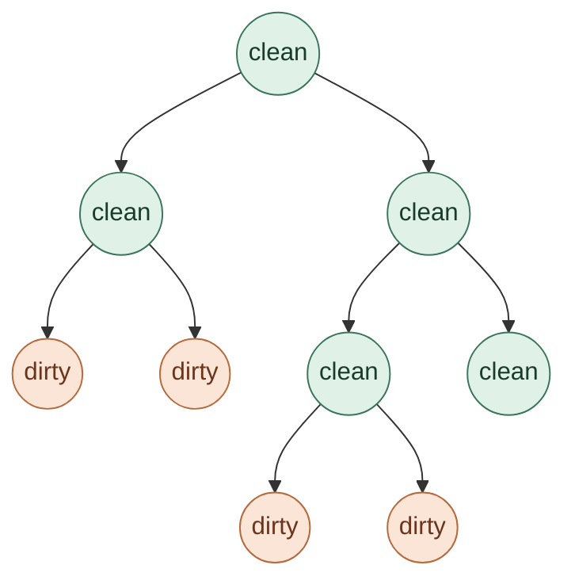
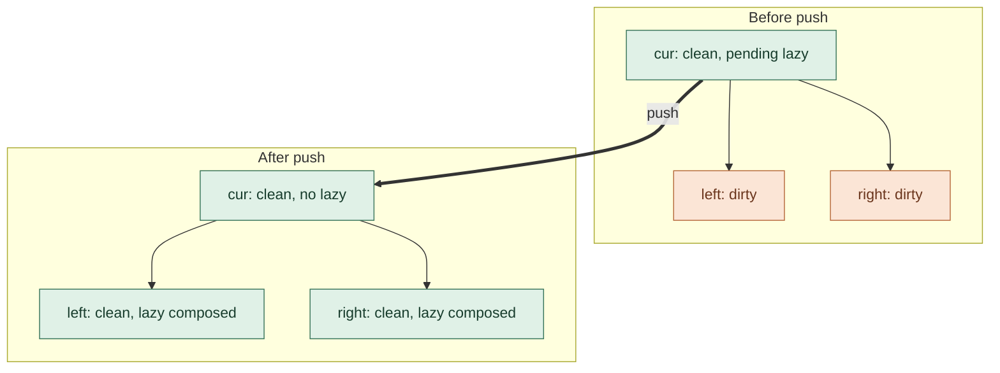

# Segment Trees

> digited from my handwritten notes by Astra-6-medium
> at a glance looks fine but you might want to check the actual source if something
> seems out of order

## 1. Concepts

The tree takes **Ops** for two types:

| Type | Meaning              | Operations                |
| ---- | -------------------- | ------------------------- |
| `S`  | Element / node value | identity, `combine(S, S)` |
| `L`  | Lazy update          | identity, `compose(L, L)` |

**`apply(S, L, len)`** connects the two. Passing `len` makes implementation easier.

> **To remember:** combine **nodes**, compose **updates**.

The API distinguishes **`set(S)`** from **`apply(L)`**: setting replaces a value; applying performs an update.

## 2. The invariant: clean values form a boundary

**Green = clean value. Orange = dirty value.** A node can have a clean value and still hold a lazy update for its children.

> **When I enter a node, it's green.**
>
> You **ALWAYS** hit a green node before an orange node.

This is the biggest invariant in this implementation. While going down, you can **ALWAYS use a full-cover node**, because the first lazy node is itself clean. Its children may still be dirty.



- If a clean parent has pending lazy, **BOTH** children still need that update.
- Once the parent's lazy is cleared by pushing, both children have clean values and may hold their own composed lazy updates.
- As you go down, **convert to green** to enforce the invariant.

## 3. Helpers

### `apply_lazy` — keep this node clean

**Need a clean node as input & keep it clean.** Think about how **THIS node** has a clean state.

| Before: `cur` + new lazy  | After: `cur′`                      |
| ------------------------- | ---------------------------------- |
| `val` — clean             | `val′` — clean, new update applied |
| `lazy` — composed updates | `lazy′` — new update composed in   |

Hence **2 steps**:

1. `apply(S, L, len)` — update the value.
2. `compose(L, L)` — compose the lazy updates.

For full cover, the current node stays **green → green**. The work for its children is deferred.

### `push` — push lazy below

Apply the parent's pending update to both children, composing it into their lazy updates. Then clear the parent's lazy.

```text
apply_lazy(left, parent.lazy)
apply_lazy(right, parent.lazy)
parent.lazy = identity
```



**After `push`:**

- Parent lazy = identity (`0` in the shorthand).
- The update is applied to both children's values.
- Both children have **clean values**.
- Both children's lazy updates have the parent's update **composed in**.

### `pull` — combine from children

Expects clean child values. Recompute the current value after changing the children:

```text
cur.val = combine(left.val, right.val)
```

## 4. Build and point operations

### `build`

```text
if seglen = 1:
    assign val to node
    return

build(left)
build(right)
pull()
```

### `get(i)` — read one value

```text
if seglen = 1:
    return val

push()
return i < mid ? get(left, i) : get(right, i)
```

### `set(i)` — replace one value

```text
if seglen = 1:
    val = new_value
    lazy = identity
    return

push()
if i < mid:
    set(left, i, new_value)
else:
    set(right, i, new_value)
pull()
```

> A **set op**, not add. **`set` has `pull`** on the way back up.

## 5. Range operations

### Query

| Current segment             | Action                                                    |
| --------------------------- | --------------------------------------------------------- |
| Out of range                | Return identity for `S`                                   |
| Fully inside                | Return current value (`S`)                                |
| Partial — need to go deeper | `push`, query both children, return their combined result |

```text
if out of range:
    return identity_S
if fully inside:
    return val

push()
return combine(query(left), query(right))
```

`push` ensures the children are clean before going deeper.

> This compute is **not for the full range of the current node**, so **NOTHING you can save** into the current node's value. Return the query result; no `pull` is needed.

### Apply

| Current segment | Action                                 |
| --------------- | -------------------------------------- |
| Out of range    | Noop                                   |
| Fully inside    | `apply_lazy`                           |
| Partial         | `push`, apply to both children, `pull` |

```text
if out of range:
    return
if fully inside:
    apply_lazy(cur, update)
    return

push()
apply(left)
apply(right)
pull()
```

> Whichever node `apply` is called on **MUST be green**. At full cover, `apply_lazy` must **keep it green**.

For partial cover, **push before descending; pull after updating**.
